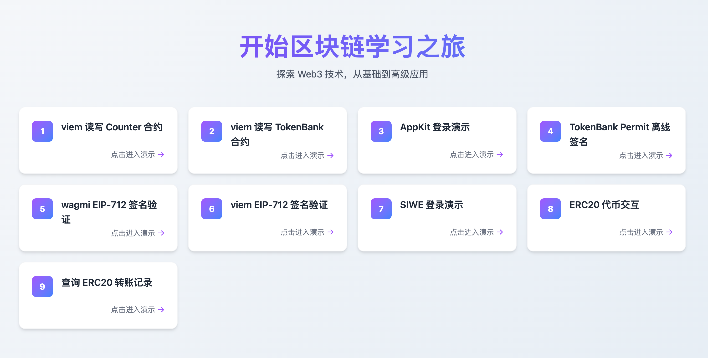
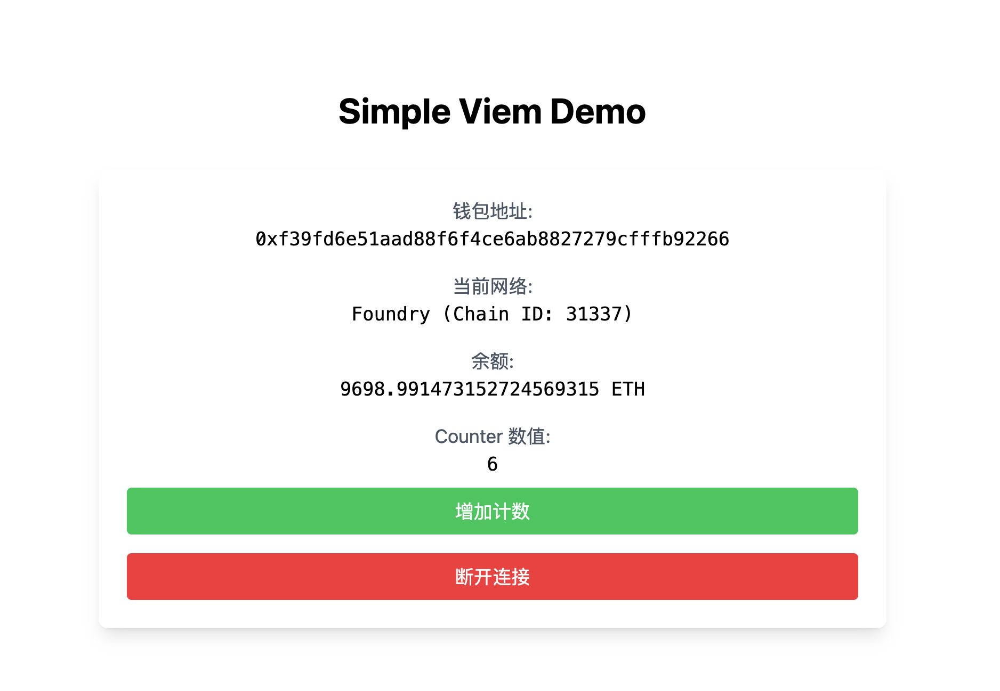
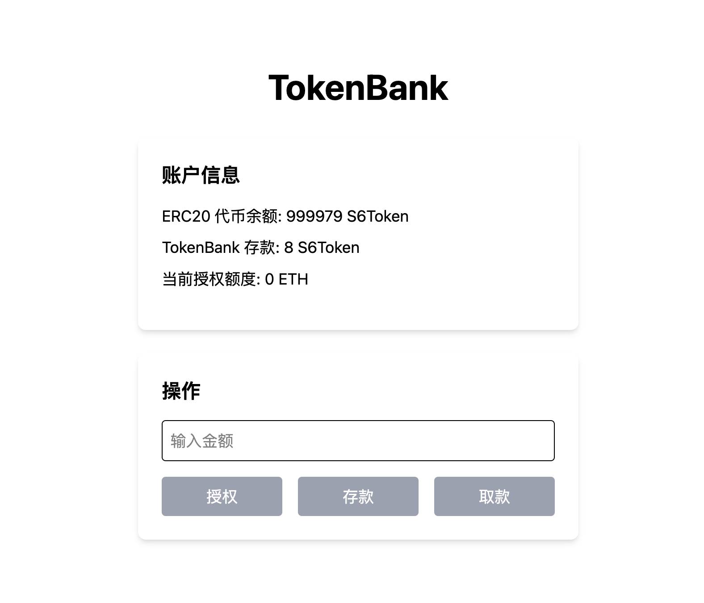
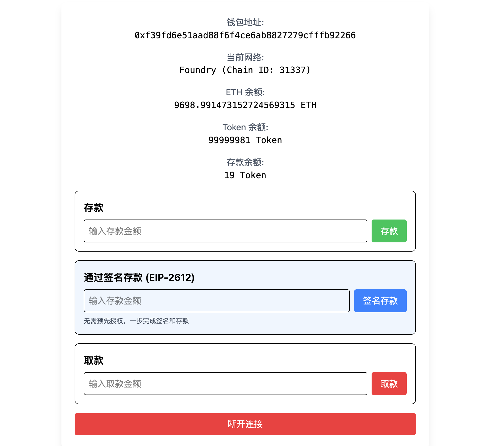
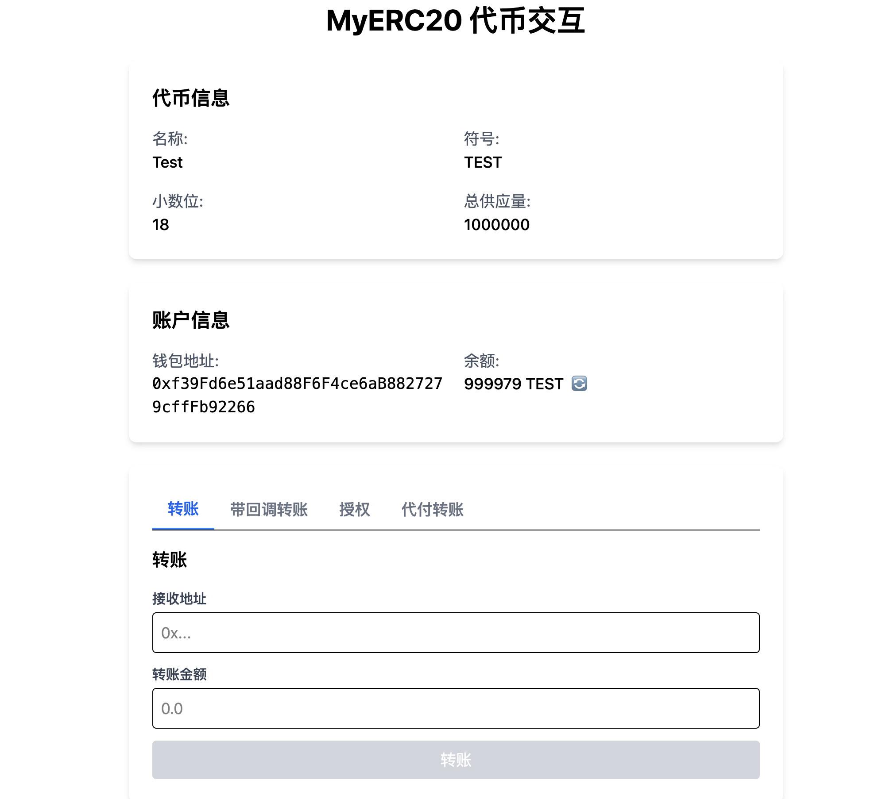

# 🚀 Learn Blockchain

[](LICENSE)
[](https://docs.soliditylang.org/)
[](https://book.getfoundry.sh/)
[](https://nextjs.org/)
[](https://www.typescriptlang.org/)

---

## 📖 项目简介

**Learn Blockchain** 是一个全栈 Web3 学习与实战项目，专为区块链开发者打造。项目覆盖智能合约开发、前端 DApp 交互、链上操作脚本三大核心领域，通过实战案例帮助开发者快速掌握 Web3 开发技能。

**🎯 目标**：为开发者提供从 Solidity 到前端集成再到脚本工具链的完整学习路径，突出技术深度和实战能力。

---

## ⭐ 核心亮点

- **🔐 权限控制实战**：Ownable、多签钱包、复杂权限模型实现
- **✍️ 签名技术深度**：EIP-712、EIP-2612 Permit、Permit2、EIP-7702 授权
- **⚡ Gas 优化技巧**：访问列表、交易模拟、高效编码解码
- **📡 事件监听机制**：实时监听 ERC20、ETH 转账事件
- **🧩 交易构建**：原生交易、签名交易、MPC 交易、EIP-7702 交易
- **🛡️ 安全实践**：白名单验证、Merkle Tree、签名验证
- **🏗️ 部署自动化**：完整的智能合约部署脚本，支持多网络部署

---

## 📁 项目结构

### 智能合约模块 (contracts/src/)

| 文件名 | 功能描述 | 测试&部署 |
|--------|----------|----------|
| 🔹 基础功能合约 | | |
| Counter.sol | 计数器合约，用于演示基本的智能合约数据存储和状态修改功能 | test/Counter.t.sol<br>script/Counter.s.sol |
| AbiEncode_Decode.sol | 用于测试ABI编码和解码机制的合约，演示如何正确编码和解码复杂数据结构 | test/AbiEncodeDecode.t.sol<br>script/AbiEncode_Decode.s.sol |
| ArrayStorage.sol | 演示数组存储访问和操作优化技术的合约实现 | script/ArrayStorage.s.sol |
| 🔹 权限控制合约 | | |
| Owner.sol | 包含所有权控制功能的基础合约，实现基础的权限控制和所有者验证机制 | script/Owner.s.sol |
| ProposalMultiSigWallet.sol | 提案型多签钱包合约，采用提案-确认-执行模式，需要预设的多个签名者中多数同意才能执行交易 | test/ProposalMultiSigWallet.t.sol<br>script/ProposalMultiSigWallet.s.sol |
| TransactionMultiSigWallet.sol | 交易型多签钱包合约，实现钱包基本功能、交易提议和多重签名确认机制 | script/TransactionMultiSigWallet.s.sol |
| 🔹 ERC-20代币合约 | | |
| BaseERC20.sol | 符合ERC-20标准的代币合约实现，提供代币转账、授权等功能 | script/BaseERC20.s.sol |
| MyERC1363Token.sol | 支持ERC-1363标准的代币合约实现，提供转账并调用接收者合约的回调功能 | script/MyERC1363Token.s.sol |
| PermitERC20.sol | 支持EIP-2612 Permit功能的ERC-20代币合约，允许无gas代币授权的离线签名 | script/PermitERC20.s.sol |
| 🔹 ERC-721 NFT合约 | | |
| MinimalERC721.sol | 最小化的ERC-721 NFT合约实现，支持NFT铸造、转移和枚举功能 | script/MinimalERC721.s.sol |
| ERC721_Upgrade.sol | 可升级ERC-721 NFT合约，使用UUPS代理模式实现合约升级功能，支持NFT铸造、转移和权限管理 | test/ERC721_Upgrade.t.sol<br>script/ERC721_Upgrade.s.sol |
| ERC721_Upgrade_V2.sol | 可升级ERC-721合约的V2版本，扩展了原有ERC721_Upgrade合约功能，添加版本标识和V2专属初始化方法 | script/ERC721_Upgrade_V2.s.sol |
| 🔹 NFT市场合约 | | |
| NFTMarketV1.sol | NFT市场合约的V1版本，支持NFT创建、购买、上架等基本市场功能 | test/NFTMarketV1.t.sol<br>script/NFTMarketV1.s.sol |
| NFTMarketV2.sol | NFT市场合约的V2版本，支持升级代理模式，允许合约功能升级和数据迁移 | test/NFTMarketV2.t.sol<br>script/NFTMarketV2.s.sol |
| AirdopMerkleNFTMarket.sol | 使用Merkle Tree实现的NFT市场空投合约，允许通过Merkle证明验证资格后领取空投 | test/AirdopMerkleNFTMarket.t.sol<br>script/AirdopMerkleNFTMarket.s.sol |
| 🔹 代币银行合约 | | |
| TokenBank.sol | 代币银行合约，管理多种代币的存取、记录用户余额和处理存取款操作 | test/TokenBank.t.sol<br>script/TokenBank.s.sol |
| TokenBankPermit.sol | 支持EIP-2612 Permit功能的代币银行合约，允许用户授权银行操作其代币 | script/TokenBankPermit.s.sol |
| TokenBankPermit2.sol | 基于Permit2的TokenBank合约版本，支持更高级的代币授权和安全性 | script/TokenBankPermit2.s.sol |
| TokenBankReceiver.sol | 支持回调功能的TokenBank合约，当使用扩展ERC20的transferWithCallback功能转账时自动处理存款 | script/TokenBankReceiver.s.sol |
| 🔹 银行/金融合约 | | |
| Bank.sol | 简单的银行合约，提供存款、取款、余额查询等基础银行功能 | script/Bank.s.sol |
| BigBank.sol | 功能更复杂的银行合约，增加了利率计算、高级权限控制等更多功能 | script/BigBank.s.sol |
| StakingPool.sol | 质押池合约，支持ETH质押获取KK代币奖励，集成借贷池实现资金管理和收益分配 | script/StakingPool.s.sol |
| 🔹 签名验证合约 | | |
| EIP712Verifier.sol | 实现EIP-712标准的消息签名验证合约，支持结构化数据的链下签名验证 | script/EIP712Verifier.s.sol |
| 🔹 安全防护合约 | | |
| ReentrancyGuard.sol | 展示传统状态变量与现代瞬态存储两种重入攻击防护方法的合约，提供银行示例进行对比分析 | test/ReentrancyGuard.t.sol<br>script/ReentrancyGuard.s.sol |
| Vault.sol | 智能合约升级漏洞与代理模式安全演示，通过fallback函数实现逻辑委托，包含可利用的安全漏洞以供学习 | test/Vault.t.sol<br>script/Vault.s.sol |
| 🔹 DEX相关合约 | | |
| MemeFactory.sol | MEME代币最小代理工厂合约，提供部署和管理多个克隆代币的能力 | test/MemeFactory.t.sol<br>script/MemeFactory.s.sol |
| MemeFactoryV2.sol | MEME代币工厂合约的V2版本，支持通过最小代理模式部署克隆代币，并与Uniswap集成实现流动性池功能 | test/MemeFactoryV2.t.sol<br>script/MemeFactoryV2.s.sol |
| MiniSwapPool.sol | 简化版DEX池合约，实现流动性添加、移除和代币兑换功能，使用x*y=k恒定乘积算法 | script/MiniSwapPool.s.sol |
| FlashSwap.sol | 闪电贷套利合约，使用Uniswap V2的闪电交换功能在不同流动性池之间进行无本金套利交易 | test/FlashSwap.t.sol<br>script/FlashSwap.s.sol |
| 🔹 特殊功能合约 | | |
| AssemblyChangeOwner.sol | 演示如何使用内联汇编更改合约所有者的高级合约示例 | script/AssemblyChangeOwner.s.sol |
| SchoolMappingList.sol | 用于演示映射和列表数据结构的学校管理系统合约，实现学生信息管理 | script/SchoolMappingList.s.sol |
| SchoolOptimized.sol | 优化的学校管理系统合约，使用更高效的存储模式降低成本和提升性能 | script/SchoolOptimized.s.sol |
| 🔹 预售/释放合约 | | |
| IDO.sol | Initial DEX Offering合约，实现代币预售、认领、退款等功能，支持软硬顶和时间限制 | script/IDO.s.sol |
| Vesting.sol | 代币锁定释放合约，实现12个月锁定期和24个月线性释放机制，支持查询进度和提取已解锁代币 | test/Vesting.t.sol<br>script/Vesting.s.sol |
| 🔹 白名单合约 | | |
| Whitelist.sol | 实现三种白名单验证方法的合约：mapping存储、EIP-712签名验证和Merkle Tree验证 | script/Whitelist.s.sol |
| 🔹 Oracle相关合约 | | |
| OracleSimple.sol | 简单的价格预言机合约，用于获取和更新链下价格数据 | test/OracleSimple.t.sol<br>script/OracleSimple.s.sol |

### 前端模块 (app/)

| 文件夹 | 功能描述 |
|--------|----------|
| appkit-demo | 使用Reown AppKit库的Web3钱包连接演示，提供多种钱包接入能力和连接状态管理 |
| erc20 | ERC-20代币交互界面，支持代币余额查询、转账、授权等多种代币操作功能 |
| nft-market | NFT市场合约的交互界面，支持NFT铸造、市场列表展示、NFT买卖和交易管理 |
| scan-transfer | 扫描和显示代币转账记录的功能，可视化展示ERC-20代币在链上的转账活动 |
| siwe | 使用Sign-In With Ethereum (SIWE) 的身份验证演示，实现基于以太坊钱包的用户身份验证 |
| tokenbank | TokenBank合约的交互界面，提供代币存取、余额查询、交易记录等功能 |
| tokenbank-permit | 支持Permit功能的TokenBank界面，允许用户在单一交易中完成授权和存入 |
| viem-counter | 使用Viem库与Counter合约交互的演示，展示直接合约读写和状态更新功能 |
| viem-eip712 | 使用Viem库的EIP-712签名演示，实现结构化数据签名和验证功能 |
| wagmi-eip712 | 使用Wagmi库的EIP-712签名演示，展示Wagmi生态下结构化数据签名的实现 |

### 脚本模块 (scripts/)

| 文件名 | 功能描述 |
|--------|----------|
| accesslist.ts | 演示如何查询、创建和使用访问列表以优化Gas成本的方法和技巧 |
| array_storage.ts | 演示数组元素访问和修改的存储操作方法，包括内存和存储的区别 |
| build_7702_tx.ts | 构建EIP-7702代码授权交易的脚本，允许合约账户授权外部账户 |
| build_raw_tx.ts | 构建和发送原始以太坊交易的脚本，包括交易签名和网络广播 |
| build_self_7702_tx.ts | 构建包含自我授权逻辑的EIP-7702交易的脚本，扩展合约代码 |
| build_tx_keystore.ts | 集成Keystore文件加密存储，使用加密私钥构建交易的脚本 |
| create_by_mnemonic.ts | 使用助记词生成HD钱包并创建多个钱包账户的工具脚本 |
| create_by_raw.ts | 使用原始私钥直接创建以太坊钱包账户的工具脚本 |
| eip712_signatures.json | EIP-712签名数据的JSON文件，存储结构化签名模板和数据 |
| generate_eip712_signature.js | 生成符合EIP-712标准结构化数据签名的工具脚本 |
| generate_merkle_tree.js | 生成Merkle树、计算节点证明并验证Merkle证明的工具脚本 |
| index.ts | 项目主脚本，整合并演示各种Viem库功能的综合应用 |
| keystore_demo.js | Keystore文件加密、解密和钱包保护功能演示脚本 |
| keystore_utils.js | Keystore格式加密与解密核心工具类的集合 |
| merkle_tree_data.json | 存储Merkle树构造原始数据和节点哈希值的JSON文件 |
| mpc_tx.js | 使用多方计算（MPC）方法生成分布式钱包交易签名的高级脚本 |
| scanERC20Transfers.ts | 扫描历史区块中的ERC-20代币转账事件并展示详细数据的监控脚本 |
| sign_verify.ts | 演示消息签名生成和链下验证机制的签名和验证演示脚本 |
| simulator_example.ts | 使用交易模拟器验证交易参数和预估Gas使用的模拟工具示例 |
| transaction_simulator.ts | 交易模拟器主类，支持多种模拟方法预估Gas和验证交易有效性 |
| watchTransfer.ts | 实时监听并处理新产生的ERC-20代币转账事件的事件监听脚本 |
| watchTransferEth.ts | 实时监听并处理ETH转账交易，监控账户ETH流动的脚本 |
| weth.ts | 与WETH（封装以太币）合约交互的演示脚本，实现ETH/WETH兑换 |

---

## 📷 前端界面（部分）

### 🎯 首页

展示所有合约功能入口。



### 🎛️ Viem Counter 演示

使用 viem 直接读写合约状态，展示基础交互模式。



### 💼 Token Bank 演示

完整的代币银行 DApp，支持存款、取款、余额查询。



### 🔐 Token Bank Permit 演示

集成 EIP-2612 Permit 功能，实现无 Gas 授权交易。



### 📊 ERC20 代币操作

与 ERC20 代币的所有读写操作。



---

## 🚀 快速开始

### 环境要求

- Node.js >= 18
- pnpm >= 8
- Foundry (forge)

### 安装依赖

```bash
# 安装前端依赖
pnpm install

# 安装合约依赖
cd contracts
forge install --no-git https://github.com/OpenZeppelin/openzeppelin-contracts-upgradeable@v5.5.0
```

### 运行前端

```bash
# 启动开发服务器
pnpm dev
```

### 编译合约

```bash
cd contracts

# 编译所有合约
forge build

# 生成 ABI
forge inspect Counter abi --json > ../abis/Counter.json
```

### 部署合约

```bash
cd contracts

# 使用部署脚本部署合约 (示例)
forge script script/Counter.s.sol:CounterScript --rpc-url $RPC_URL --private-key $PRIVATE_KEY --broadcast

# 或在本地节点上部署 (需要先启动本地节点)
anvil
forge script script/Counter.s.sol:CounterScript --rpc-url http://localhost:8545 --private-key $PRIVATE_KEY --broadcast
```

### 运行脚本

```bash
# 运行演示脚本
pnpm tsx scripts/index.ts

# 运行交易模拟
pnpm tsx scripts/simulator_example.ts
```

---

## 📚 推荐学习路径

1. **基础入门** 📖
   - 阅读 `Counter.sol` 了解 Solidity 基础
   - 运行 `viem-counter` 前端示例

2. **权限控制** 🔐
   - 学习 `Ownable.sol`、`ProposalMultiSigWallet.sol` 和 `TransactionMultiSigWallet.sol`
   - 实践多签钱包的创建和使用

3. **签名技术** ✍️
   - 理解 EIP-712 标准
   - 实践 Permit 和 Permit2 功能

4. **Gas 优化** ⚡
   - 学习访问列表使用
   - 实践交易模拟和优化

5. **安全实践** 🛡️
   - 实现白名单验证
   - 学习 Merkle Tree 应用

6. **高级功能** 🚀
   - 探索 EIP-7702 授权
   - 实现链上数据分析
   - 使用部署脚本部署合约到目标网络

---

## 🛠️ 技术栈

### 智能合约
- **Solidity 0.8.20+** - 现代 Solidity 特性
- **Foundry** - 高效开发工具链
- **OpenZeppelin** - 安全合约库
- **EIP 标准** - EIP-20, EIP-712, EIP-2612, EIP-7702

### 前端技术
- **Next.js 14** - App Router + Server Components
- **TypeScript** - 类型安全
- **viem** - 轻量级以太坊客户端
- **wagmi** - React hooks 集成
- **Tailwind CSS** - 原子化 CSS

### 开发工具
- **Prettier** - 代码格式化
- **pnpm** - 包管理
- **tsx** - TypeScript 执行器

---

## 📝 许可证

本项目采用 [MIT 许可证](LICENSE)。

---

## 🤝 贡献指南

欢迎 Start、提交 Issue 和 Pull Request！

**特别说明**：本项目专注于技术学习，所有代码均用于教育目的。